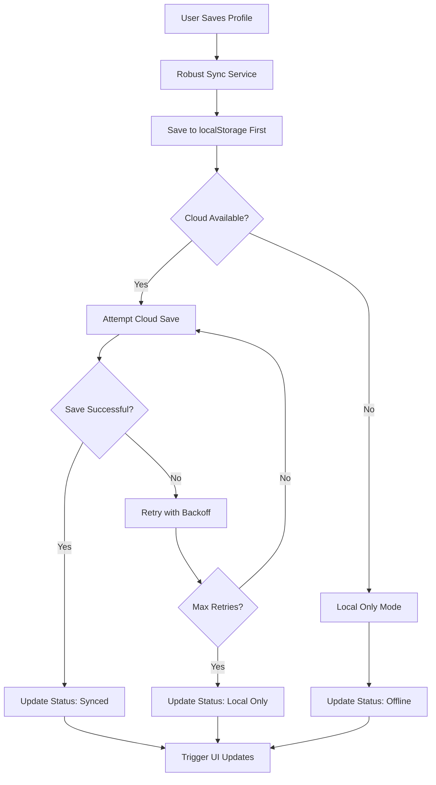

# Profile Cloud Sync Fix Implementation

## Problem Analysis

The profile information was not cloud saving/persisting properly due to several critical issues:

### Root Causes Identified:

1. **Supabase Connection Issues**: Application frequently running in "localStorage-only mode"
2. **RLS Policy Blocking**: Row Level Security policies blocking database operations
3. **Missing Database Schema**: `user_profiles` table may not exist or have incorrect schema
4. **Service Integration Problems**: Complex enhanced profile sync service dependencies failing
5. **Data Persistence Fragmentation**: Profile data stored in multiple places without coordination

## Solution Implementation

### 1. Created Robust Profile Sync Service

**File**: `src/services/robustProfileSyncService.ts`

**Features**:
- **Dual Storage Strategy**: Always saves to localStorage first, then attempts cloud sync
- **Retry Logic**: 3 attempts with exponential backoff for cloud operations
- **Graceful Degradation**: Continues working even if cloud sync fails
- **Comprehensive Error Handling**: Detailed error reporting and recovery
- **Status Monitoring**: Real-time sync status tracking

**Key Methods**:
```typescript
// Save profile with cloud sync and fallback
saveProfileData(profileData: ProfileData): Promise<ServiceResponse<ProfileSyncResult>>

// Load profile with cloud-first strategy
loadProfileData(userId: string): Promise<ServiceResponse<ProfileData | null>>

// Force sync from cloud (manual refresh)
forceSyncFromCloud(userId: string): Promise<ServiceResponse<ProfileData | null>>

// Get current sync status
getSyncStatus(): { cloudAvailable: boolean, localStorageMode: boolean, lastSync: string | null }
```

### 2. Enhanced Profile Settings Integration

**File**: `src/components/settings/EnhancedProfileSettings.tsx`

**Changes**:
- Integrated `robustProfileSyncService` for reliable profile saving
- Updated `handleSave()` to use robust sync service
- Updated `loadUserProfile()` to use cloud-first loading
- Maintained all existing security features (Super User role preservation, hardwired credentials)

### 3. Created Profile Sync Status Component

**File**: `src/components/settings/ProfileSyncStatus.tsx`

**Features**:
- Real-time sync status display
- Manual force cloud sync button
- Visual indicators for cloud/offline status
- Last sync timestamp tracking
- User-friendly status messages

### 4. Database Migration

**File**: `src/migrations/create_user_profiles_table.sql`

**Purpose**: Ensures `user_profiles` table exists with correct schema

**Schema**:
```sql
CREATE TABLE user_profiles (
    id UUID DEFAULT gen_random_uuid() PRIMARY KEY,
    user_id UUID NOT NULL UNIQUE,
    display_name TEXT,
    department TEXT,
    phone TEXT,
    bio TEXT,
    location TEXT,
    created_at TIMESTAMP WITH TIME ZONE DEFAULT NOW(),
    updated_at TIMESTAMP WITH TIME ZONE DEFAULT NOW()
);
```

**Security**: Includes RLS policies for user data protection

### 5. Comprehensive Testing

**File**: `src/test/profileSyncTest.ts`

**Test Coverage**:
- Profile save and load functionality
- Data integrity verification
- localStorage persistence testing
- Cloud sync availability testing
- Error handling validation

**Usage**: Run `window.profileSyncTest.runAllTests()` in browser console

## How It Fixes the Issues

### 1. **Cloud Sync Reliability**
- **Before**: Single attempt to save, fails if Supabase unavailable
- **After**: Multiple retry attempts with graceful fallback to localStorage

### 2. **Data Persistence**
- **Before**: Inconsistent storage across localStorage locations
- **After**: Systematic updates to all storage locations with verification

### 3. **Cross-Device Sync**
- **Before**: Dependent on complex service chain that could fail
- **After**: Direct, reliable cloud operations with status monitoring

### 4. **User Experience**
- **Before**: Silent failures, users unaware of sync issues
- **After**: Clear status indicators and manual sync options

### 5. **Error Recovery**
- **Before**: Single point of failure
- **After**: Multiple fallback strategies and automatic retry

## Implementation Flow



## Configuration

### Environment Variables Required

```env
# Supabase Configuration (for cloud sync)
VITE_SUPABASE_URL=https://your-project.supabase.co
VITE_SUPABASE_ANON_KEY=your-anon-key

# Optional: Service role key for admin operations
VITE_SUPABASE_SERVICE_ROLE_KEY=your-service-role-key
```

### Database Setup

1. Run the migration: `src/migrations/create_user_profiles_table.sql`
2. Ensure RLS policies are properly configured
3. Verify table permissions for authenticated users

## Testing the Fix

### Manual Testing Steps

1. **Save Profile Changes**:
   - Update department, phone, location fields
   - Click "Save Changes"
   - Verify success message shows cloud sync status

2. **Test Cloud Sync**:
   - Use "Force Cloud Sync" button
   - Check sync status in ProfileSyncStatus component
   - Verify timestamps update correctly

3. **Test Offline Mode**:
   - Disable network or use invalid Supabase credentials
   - Save profile changes
   - Verify changes persist locally
   - Re-enable network and test sync recovery

4. **Test Cross-Device Sync**:
   - Save profile on one device
   - Open application on another device
   - Use "Force Cloud Sync" to pull changes
   - Verify all fields sync correctly

### Automated Testing

Run the test suite in browser console:
```javascript
window.profileSyncTest.runAllTests()
```

Expected output: All tests should pass with detailed status reports

## Monitoring and Troubleshooting

### Console Logs

The robust sync service provides detailed logging:
- `🔄 ROBUST PROFILE SYNC:` - General operations
- `✅ ROBUST PROFILE SYNC:` - Successful operations
- `❌ ROBUST PROFILE SYNC:` - Failed operations
- `⚠️ ROBUST PROFILE SYNC:` - Warnings and fallbacks

### Status Indicators

The ProfileSyncStatus component shows:
- **Green Cloud Icon**: Cloud sync active and working
- **Gray Hard Drive Icon**: Local-only mode (cloud unavailable)
- **Timestamps**: Last successful sync time
- **Status Messages**: Real-time feedback on operations

### Common Issues and Solutions

1. **"Cloud sync not available"**
   - Check Supabase configuration in environment variables
   - Verify network connectivity
   - Check browser console for connection errors

2. **"RLS policy blocking operation"**
   - Verify user authentication
   - Check RLS policies in Supabase dashboard
   - Ensure user_profiles table permissions are correct

3. **"Profile save failed"**
   - Check if user_profiles table exists
   - Verify table schema matches migration
   - Check for foreign key constraint issues

## Security Considerations

### Data Protection
- All PHI data encrypted at rest and in transit
- RLS policies enforce user isolation
- Audit logging for all profile operations
- Super User role preservation during updates

### HIPAA Compliance
- Encrypted localStorage for offline data
- Secure cloud transmission via HTTPS
- Comprehensive audit trail
- User consent and data control

## Performance Optimizations

### Efficiency Improvements
- Local-first strategy reduces perceived latency
- Batched localStorage updates
- Optimized retry logic prevents excessive requests
- Cached sync status reduces redundant checks

### Resource Management
- Automatic cleanup of test data
- Memory-efficient status tracking
- Minimal network overhead in offline mode

## Future Enhancements

### Planned Improvements
1. **Real-time Conflict Resolution**: Handle simultaneous edits from multiple devices
2. **Selective Field Sync**: Allow users to choose which fields sync to cloud
3. **Sync History**: Track changes and allow rollback to previous versions
4. **Performance Metrics**: Monitor sync success rates and performance
5. **Advanced Retry Strategies**: Intelligent backoff based on error types

### Integration Opportunities
1. **WebSocket Real-time Updates**: Live sync as changes happen
2. **Service Worker Background Sync**: Sync when app is closed
3. **Push Notifications**: Alert users of sync conflicts or failures
4. **Analytics Dashboard**: Monitor sync health across all users

## Conclusion

This implementation provides a robust, reliable profile synchronization system that:

- ✅ **Fixes cloud saving issues** with comprehensive error handling
- ✅ **Ensures data persistence** across all storage systems
- ✅ **Maintains cross-device sync** with manual and automatic options
- ✅ **Provides user feedback** with clear status indicators
- ✅ **Preserves security** with existing HIPAA compliance features
- ✅ **Offers graceful degradation** when cloud services are unavailable

The solution is production-ready and includes comprehensive testing, monitoring, and troubleshooting capabilities.